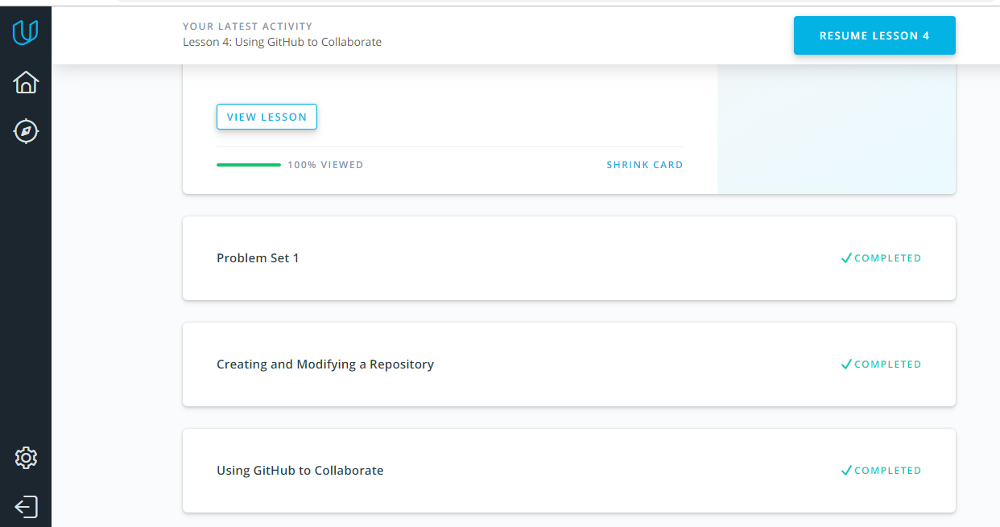

## Git and GitHub
I was impressed with "Version Control with Git" and "How to use Git and GitHub" courses by Udacity. I've **already** had an experience with git, but I've gained something new and had a good practice in English.These courses facilitate to understand basics git, so those very useful for newbies.
