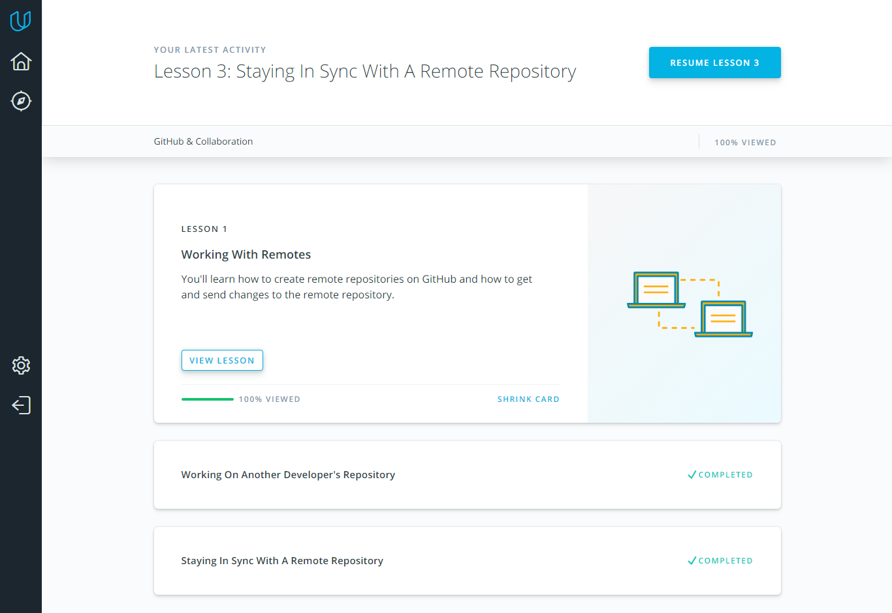

## Git Collaboration

*what was new to you*  
o I understood the difference between fetch and pull.

*what surprised you*  
that git add . only affects the current working directory and 
subdirectories

*what you intend to use in future*  
git commit --ammend