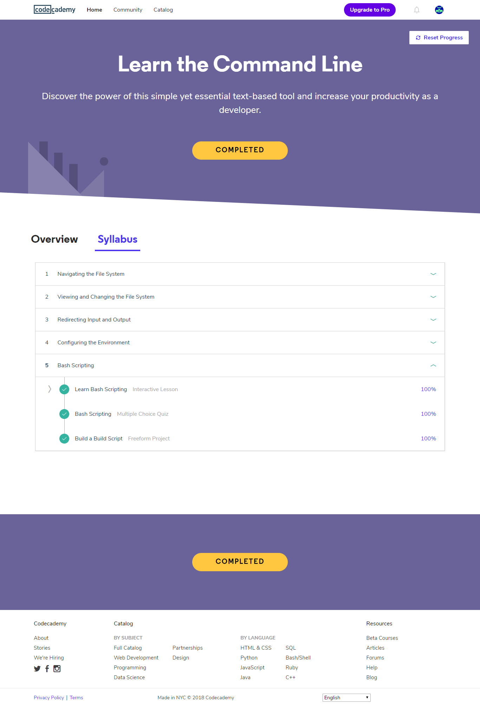

## Linux CLI, and HTTP

*what was new to you*  
Bash scripting (the last lesson but not the least) - is really cool and exciting

*what surprised you*  
that cd stands for "change directory" (:

*what you intend to use in future*  
I will definitely use aliases