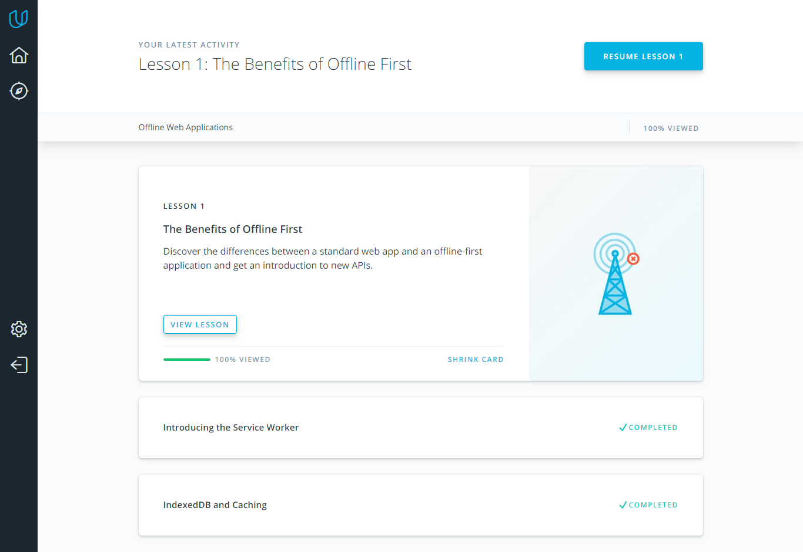

## Offline Web Applications

*what was new to you*  
I've learned the differences between good, poor, intermittent, and missing connectivity for  users 

*what surprised you*  
That the web platform has a database called indexed DB.

*what you intend to use in future*  
For a better user experience it's good to cache photos, and the useful thing is the cache API and put them in a separate cache.

